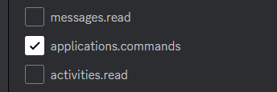
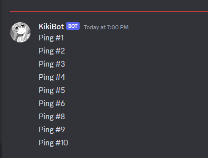
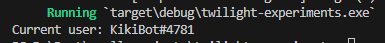
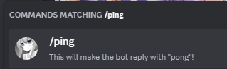
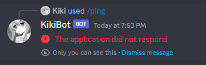
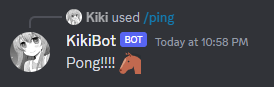

# Ping-Pong

Naturally, knowing a tiny bit about Discord bots, I know bots have the ability to receive commands, such as a user typing out `/sayhello` in the chat of some channel in some server, so that the bot will then take that command and respond in some way, such as replying to that message with a "Hi!".

Creating a bot by itself is not a hard task, given that Discord itself has a cute little [tutorial](https://discord.com/developers/docs/intro) involving logging into your developer account and creating a new app. Considering my close friends gave me nickname "Kiki", I've decided to name it the "KikiBot". Gave it a nice app icon that matches my profile picture and I'm hopefully ready to go.

My first issue was looking for an example of how can I even introduce a command to my bot. By inspecting a simple [example](https://github.com/twilight-rs/twilight/blob/main/examples/http-get-message.rs), I've noticed it does a few things.

```rs
use futures_util::future;
use std::{env, future::IntoFuture};
use twilight_http::Client;
use twilight_model::id::Id;

#[tokio::main]
async fn main() -> anyhow::Result<()> {
    // Initialize the tracing subscriber.
    tracing_subscriber::fmt::init();
    
    let client = Client::new(env::var("DISCORD_TOKEN")?);
    let channel_id = Id::new(381_926_291_785_383_946);

    future::join_all((1u8..=10).map(|x| {
        client
            .create_message(channel_id)
            .content(&format!("Ping #{x}"))
            .expect("content not a valid length")
            .into_future()
    }))
    .await;

    let me = client.current_user().await?.model().await?;
    println!("Current user: {}#{}", me.name, me.discriminator);

    Ok(())
}
```

1. Initialize a tracing subscribed (no clue what that is so far)

2. Set up the client with a token (I'll get to that in a second) and select a very specific channel in a specific server.

3. It then sends 10 messages to that channel saying "Ping #{x}$ where "{x}" is a number from 1 to 10.

4. Finally, it prints to the console the current user's username with discriminator (that didn't age well, as Discord just removed the discriminator a few months ago).

First thing to do is naturally, invite your bot to a server you own. You could just make a test server with just you, if you need, I recommend testing it in a closed environment like that, in case things go south. To invite your bot to your own server, go to the OAuth2 tab in the developer portal and tick the boxes `Bot` and `application.commands`<sup>2</sup>. The latter is very important for the slash commands to work for some reason.



Ticking "Bot" will open up a plethora of bot permissions. Tick all the ones relevant to you. I basically ticked most of them except for the audio ones and banning/kicking ones.
My first step was to copy that code into my `main.rs`, commenting out the `tracing_subscriber::fmt::init();` line and import the required things.

```toml
[dependencies]
twilight-model = "0.15.4"
twilight-http = "0.15.4"
tokio = { features = ["macros", "signal", "rt-multi-thread"], version = "1.0" }
anyhow = "1.0.79"
futures-util = "0.3.30"
```

Obviously, if you're reading this in the future, those versions will very likely be different, except for tokio. Next up, in the Discord developer portal of my application, I clicked the Bot tab to copy the secret token of my bot. I created a `.cargo/config.toml` file inside my root folder and added

```toml
[env]
DISCORD_TOKEN = "here goes the very secret token"
```

Naturally, that's where you paste the token you copied from the developer portal. Importantly, I made sure to add `.cargo` to my `.gitignore`, since I'm not trying to leak my token once I upload this repo to github. Then, I chose any channel in my server, right clicked it and at the bottom, copied the channel ID, to replace it in the `channel_id` variable. That's pretty much everything I did! Once I hit `cargo run`, it took half a minute to compile and there it was, in that exact channel<sup>1</sup>! (see footnote)



and in my console,



In the words of yellow shy, "yay"! It seems we have a functioning bot. Our next step is to add a working command to its list of commands. By inspecting the [documentation](https://docs.rs/twilight-http/0.15.4/twilight_http/client/struct.InteractionClient.html#method.create_global_command), this is done through a `create_global_command` method. Interestingly, it seems like it's possible to create commands only present in a specific server, which makes sense, since it allows server moderators to add their own custom commands using a bot. From there, I can either add a `chat_input` command (which is what we want), a `message` command, and a `user` command. I wasn't sure what those two did until I looked them up in the [developer portal](https://discord.com/developers/docs/interactions/application-commands#user-commands).

For the sake of testing things out, we might as well add all three! Here's how it looks.

```rs
#[tokio::main]
async fn main() -> anyhow::Result<()> {
    
    let client = Client::new(env::var("DISCORD_TOKEN")?);

    // Cache the application ID for repeated use later in the process.
    let application_id = {
        let response = client.current_user_application().await?;
        response.model().await?.id
    };

    let interaction_client = client.interaction(application_id);

    interaction_client.create_global_command()
        .chat_input("ping", "This will make the bot reply with \"pong\"!")?
        .await?;

    interaction_client.create_global_command()
        .message("Nice message!")?
        .await?;

    interaction_client.create_global_command()
        .user("Nice user!")?
        .await?;

    Ok(())
}
```

Of course, I decided to be silly and run this code, until I realized it ran for 1 second and the bot went offline. Obviously, we need some sort of "standby" mode so that the program instead of stopping as soon as everything is done, it awaits for commands so that the bot knows what to do. For this, we need to add [`twilight-gateway`](https://crates.io/crates/twilight-gateway) to the depedencies! I then deleted all this code, to make sure we don't run these `create_global_commands` repeatedly, as Discord [states](https://discord.com/developers/docs/interactions/application-commands#registering-a-command) you're only allowed to register a command 200 times per day per server.

The process is a bit more involved. First, we need to state the intents of a bot, which details what kind of information or power is it allowed to possess. For now, I'll set intents to empty and just see what happens.

The gateway is the way to receive user events and respond to them. Big bots will require multiple gateways operating at the same time, for efficiency, which is done by creating multiple shards. Since out bot is purely for testing, we just have one shard. The next part is to create the loop that will listen to events and respond accordingly, which here I just stole the example code from the [documentation](https://docs.rs/twilight-gateway/latest/twilight_gateway/). I've decided to include the "tracing subscriber", as it seems like a debugger on steroids that's probably very good for async stuff.

```toml
[dependencies]
# ...
twilight-gateway = "0.15.4"
tracing = "0.1.40"
tracing-subscriber = "0.3.18"
```

and now it all looks like this!

```rs
use std::env;
use twilight_gateway::{Intents, Shard, ShardId};

#[tokio::main]
async fn main() -> anyhow::Result<()> {
    // Initialize the tracing subscriber.
    tracing_subscriber::fmt::init();

    let intents = Intents::empty();
    let mut shard = Shard::new(ShardId::ONE, env::var("DISCORD_TOKEN")?, intents);

    loop {
        let event = match shard.next_event().await {
            Ok(event) => event,
            Err(source) => {
                tracing::warn!(?source, "error receiving event");

                // If the error is fatal, as may be the case for invalid
                // authentication or intents, then break out of the loop to
                // avoid constantly attempting to reconnect.
                if source.is_fatal() {
                    break;
                }

                continue;
            },
        };

        // You'd normally want to spawn a new tokio task for each event and
        // handle the event there to not block the shard.
        tracing::debug!(?event, "received event");
    }

    Ok(())
}
```

After this, the bot went online, and that's where things crumbled very quickly. First, it did register all the commands we added earlier!



But trying it out gave me this...



I understand why, since our bot does nothing so far once we send in the command, but it also doesn't log it into my console. Once I inspected my console, it only said this:

```
  INFO twilight_gateway_queue: shard 0/1 waiting for allowance
```

with absolutely no mention of any commands being triggered. I waited for a good two minutes and nothing happened, so I `Ctrl+C`'d the app. Interestingly, the bot remained online after that for maybe a minute (potentially because Discord gives bots which disconnect some time to reconnect before actually declaring them as fully offline).

I was a bit stumped. Googling gave me nothing to work with, as it seems no other newbies like me had this exact specific problem in the past. I ended up just plainly asking a question in the Twilight discord server directly and got my answer really quickly by a very kind individual. The bot was indeed actually working, what was happening is that `tracing::debug` only outputs to the console if the environment variable `RUST_LOG` is set to default. So one solution is to set

```toml
[env]
# ...
RUST_LOG = "debug"
```

but that will also output every debug message, which is just going to clutter our console (especially since I don't know what most of it means). The solution is to change that line for

```rs
        tracing::info!(?event, "received event");
```

as `tracing::info` will output to the console by default. After running the bot again, I noticed the following events being shown to the console:

* `received event event=GatewayHello( ... )`

Probably some sort of handshake.

* `received event event=Ready( ... )`

This one is likely the event triggered once my shard is ready.

* `received event event=GatewayHeartbeatAck`

This one actually gets triggered about every 40 seconds, which seems to be just a detection to see if the bot is alive.

Besides those, now if we try running each of the three commands we created, they should appear in the console. For example, `/ping` will show

```
received event event=InteractionCreate(InteractionCreate(
    ...
))
```

Naturally, I'm ommitting all of the information since I'm afraid there might be something confidential in there. Similarly, user commands are working, as I can right click any user and this will appear.


Once I click on it, I get another `InteractionCreate` event. If I right click a message, the command "Nice message!" also shows up, which also triggers an event that gets logged to the console.

To parse the command, there are tons of information regarding the event, but the one that's mostly useful to respond a "ping" command is the [`InteractionData`](https://docs.rs/twilight-model/0.15.4/twilight_model/application/interaction/enum.InteractionData.html). Let's make a more thorough inspection when we update our code to:

```rs
use twilight_gateway::Event;

// ...
    loop {
        // ...

        if let Event::InteractionCreate(ref interaction) = event {
            if let Some(ref interaction_data) = interaction.data {
                tracing::info!(?interaction_data, "received event");
                continue
            }
        }

        // You'd normally want to spawn a new tokio task for each event and
        // handle the event there to not block the shard.
        tracing::info!(?event, "received unknown event");
    }

    Ok(())
// ...
```

Again, your console will be quite a bit flooded depending on what message you clicked. For example, the `ping` command just logs

```
ApplicationCommand(
    CommandData {
        guild_id: None,
        id: Id<CommandMarker>(1200568034960625714),
        name: "ping",
        kind: ChatInput,
        options: [],
        resolved: None,
        target_id: None
    }
)
```

Naturally, I prettified it in this webpage, but all of this was shown in one line. `kind` is where we can find out if this is a chat command, a user command, or a message command. This way, we could have another message command called "ping" and a user command called "ping", and we can still make a distinction between all three.

To respond to a command, we need to get our client back, to make use of the [`InteractionClient`](https://docs.rs/twilight-http/latest/twilight_http/client/struct.InteractionClient.html). Command responses are simply http requests, and are completely disconnect from the gateway. Once we get a hold of the `InteractionClient`, we create an [`InteractionResponse`](https://docs.rs/twilight-model/0.15.4/twilight_model/http/interaction/struct.InteractionResponse.html) of type [`ChannelMessageWithSource`](https://docs.rs/twilight-model/0.15.4/twilight_model/http/interaction/enum.InteractionResponseType.html) (since we wish to respond to the command with a "pong" message) and the only thing in the response that matters for now is the `content` of the [`InteractionResponseData`](https://docs.rs/twilight-model/0.15.4/twilight_model/http/interaction/enum.InteractionResponseType.html).

Once we have a response, all we have to do is call [`create_response`](https://docs.rs/twilight-http/latest/twilight_http/client/struct.InteractionClient.html#method.create_response) once we get a hold of the interaction `id` and `token` from the `interaction`. All in all, the code now looks like this.

```rs
#[tokio::main]
async fn main() -> anyhow::Result<()> {
    // Initialize the tracing subscriber.
    tracing_subscriber::fmt::init();

    tracing::info!("started shard");

    let client = Client::new(env::var("DISCORD_TOKEN")?);

    let application_id = {
        let response = client.current_user_application().await?;
        response.model().await?.id
    };
    
    // Later in the process...
    let interaction_client = client.interaction(application_id);

    let intents = Intents::GUILD_MESSAGES;
    let mut shard = Shard::new(ShardId::ONE, env::var("DISCORD_TOKEN")?, intents);

    loop {
        let event = match shard.next_event().await {
            Ok(event) => event,
            Err(source) => {
                tracing::warn!(?source, "error receiving event");

                // If the error is fatal, as may be the case for invalid
                // authentication or intents, then break out of the loop to
                // avoid constantly attempting to reconnect.
                if source.is_fatal() {
                    break;
                }

                continue;
            },
        };

        if let Event::InteractionCreate(ref interaction) = event {
            let id = interaction.id;
            let token = &interaction.token;
            if let Some(ref interaction_data) = interaction.data {
                if let InteractionData::ApplicationCommand(ref cmd) = interaction_data {
                    if cmd.name == "ping" {
                        let response = InteractionResponse {
                            kind: InteractionResponseType::ChannelMessageWithSource,
                            data: Some(InteractionResponseData {
                                content: Some("Pong!!!! :horse:".to_string()),
                                ..Default::default()
                            })
                        };
        
                        interaction_client.create_response(id, token, &response).await?;
                    }
                }
            }
        } else {
            tracing::info!(?event, "received unknown event");
        }
    }

    Ok(())
}
```

And once we run it again, we get...



Brilliant! A bit messy, since we're manually decoupling each enum variant and making a lot of if statements, but this is all just a test to make sure we can make our bot do something very basic. Our objective for this section is essentially done.

---

1. Me from the future here! I realized after revising this page before uploading this book online that "Task #7" never got printed out!! If I didn't foolishly remove the tracing part of the code and actually ran the same code with tracing on, I would get a warning message with a status code `429` in the console. You might be familiar with 404 errors, which mean "not found". 429 means "too many requests", meaning the bot is sending too many messages at once, and so task #7 got cut off, and since a little bit of time passes after that, the following 8, 9, and 10 all go through with no issue.

2. According to the [Discord API](https://discord.com/developers/docs/topics/oauth2), `applications.commands` is already "ticked" by default when we tick `bot`, so it seems you don't actually need to tick it. But it doesn't hurt. 