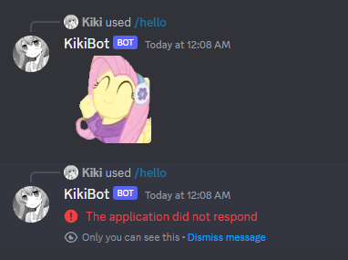

# Splitting Tasks

If we run the same code as the previous page and try to call the `/hello` command twice (or suppose two users call it at the same time), only the first command will go through.



This is because our code will completely halt listening to events while it's processing a hello message. To ensure our bot can handle multiple requests at the same time, we need it to split tasks as fast as possible. That is, right after listening to an event, we "spawn a thread" and do the event handling on that new thread, allowing for the main thread to keep going and listen to more events as they come in.

When I say "spawn a thread", that's not what we'll literally do. If our bot is hosted in a server with a CPU containing 64 cores, having 1000 threads handling 1000 different user commands is more harmful than helpful. Thankfully, async is here so that we have to do **zero thread handling**, and letting [Tokio](https://tokio.rs/), the biggest Rust async runtime to do that for us. All we have to do is spawn one tokio task everytime an event shows up.

Responding to events requires the http client, so every task spawned will require the event itself, and a reference to the http client. However, due to the way tokio's [spawn function](https://docs.rs/tokio/latest/tokio/task/fn.spawn.html) works, whatever async block is spawned needs to return a static future (that is, it must have an infinite lifetime). But if we include a reference to the client, it ends up tied to its lifetime, which does not live long enough.

Assuming we'll potentially have lots of tasks running at once, taking a reference to the client, we'll wrap it in an [`Arc`](https://doc.rust-lang.org/std/sync/struct.Arc.html), which is just the thread-safe version (a.k.a the one we can use for async stuff) of [`Rc`](https://doc.rust-lang.org/std/rc/struct.Rc.html), which is the safe alternative that serves the purpose (but doesn't literally do so) of "extending a reference's lifetime".

When we wrap something inside an Rc, it stores its internal value on the heap and internally stores a count of how many threads are referencing this object, starting at 1. Everytime we wish to take a reference of the object, we instead clone it, since `Rc::clone` won't literally clone the internal bits of the object (which can be expensive) and instead just clones the pointer to the original value stored on the heap, and increments the counter to 1. Everytime the reference drops, the count decrements. Once the count hits zero, nothing is referencing that object, and the whole Rc is dropped.

We can't use Rc here because of its thread unsafety. Imagine if two threads try to increment the counter at the same time, trying to mutate the same value twice. I won't explain here how thread-safety is achieved, but internally, Rc uses `usize` to count, while Arc uses [`AtomicUsize`](https://doc.rust-lang.org/std/sync/atomic/struct.AtomicUsize.html), the thread-safe counterpart.

However, since we'll be dealing with interactions, it's always good to be able to extract the interaction client from the client itself inside the spawned tasks.<sup>1</sup> Thus, we'll wrap both the http client and the application id inside the Arc. Here's the idea.

```rs
use twilight_model::id::{Id, marker::ApplicationMarker};
use twilight_http::Client;
use std::ops::Deref;

struct ApplicationClient {
    client: Client,
    id: Id<ApplicationMarker>,
}

impl ApplicationClient {
    async fn new(token: String) -> anyhow::Result<Self> {
        let client = Client::new(token);

        let id = {
            let response = client.current_user_application().await?;
            response.model().await?.id
        };

        Ok(Self { client, id })
    }

    fn interaction(&self) -> InteractionClient<'_> {
        self.client.interaction(self.id)
    }
}

impl Deref for ApplicationClient {
    type Target = Client;

    fn deref(&self) -> &Self::Target {
        &self.client
    }
}
```

We will wrap `ApplicationClient` into an Arc. Every spawned task will take a clone of it that can be dereferenced into an `&ApplicationClient`. That itself can be either dereferenced again into a `&Client` or we can retrieve the interaction client using the `interaction` method. Thus,

```rs
#[tokio::main]
async fn main() -> anyhow::Result<()> {
    let token = env::var("DISCORD_TOKEN")?;

    let client = Arc::new(
        ApplicationClient::new(token.clone()).await?
    );

    let intents = Intents::GUILD_MESSAGES;
    let mut shard = Shard::new(ShardId::ONE, token, intents);

    loop {
        let event = match shard.next_event().await {
            Ok(event) => event,
            Err(source) => {
                tracing::warn!(?source, "error receiving event");

                if source.is_fatal() {
                    break;
                }

                continue;
            },
        };

        tokio::spawn(handle_event(event, Arc::clone(&client)));
    }

    Ok(())
}

async fn handle_event(
    event: Event,
    client: Arc<ApplicationClient>
) -> anyhow::Result<()> {
    todo!()
}
```

The startup code looks much cleaner now, and every event is now being handled in separate tasks which are called in separate "tokio tasks" asynchronously. If we then almost copy-paste our original (quite awful) code from the previous section like this...

```rs
async fn handle_event(
    event: Event,
    client: Arc<ApplicationClient>
) -> anyhow::Result<()> {
    if let Event::InteractionCreate(ref interaction) = event {
        
        // we get the interaction client like this
        let interaction_client = client.interaction();

        let id = interaction.id;
        let token = &interaction.token;
        if let Some(ref interaction_data) = interaction.data {
            if let InteractionData::ApplicationCommand(ref cmd) = interaction_data {
                match cmd.name.as_str() {
                    "ping" => {
                        let response = InteractionResponse {
                            kind: InteractionResponseType::ChannelMessageWithSource,
                            data: Some(InteractionResponseData {
                                content: Some("Pong!!!! :horse:".to_string()),
                                ..Default::default()
                            })
                        };
        
                        interaction_client.create_response(id, token, &response).await?;
                    },
                    "hello" => {
                        let initial_response = InteractionResponse {
                            kind: InteractionResponseType::DeferredChannelMessageWithSource,
                            // deferred messages don't require any data
                            data: None
                        };
            
                        interaction_client
                            .create_response(id, token, &initial_response)
                            .await?;
            
                        // we artificially sleep for 10 seconds
                        tokio::time::sleep(Duration::from_secs(10)).await;
            
                        let gif = "https://cdn.discordapp.com/emojis/645667403291820044.gif?size=96&quality=lossless";
            
                        interaction_client
                            .update_response(token)
                            .content(Some(gif))?
                            .await?;
                    },
                    _ => {}
                }
            }
        }
    } else {
        tracing::info!(?event, "received unknown event");
    }

    Ok(())
}
```

> **Important**: This time, notice we don't use the sleep function from `std::thread` because each tokio task isn't literally separated by different threads. Tokio avoids creating more threads than needed, so some tasks might be done in the same thread (and if we have thousands of tasks, there's nothing else we can do). Because of this, we cannot make the whole thread sleep, so we use the tokio version of sleep, which only sleeps the current task itself.

I then cargo ran and sent multiple hello commands. The results can be seen below.

<video width="576" height="324" controls loop muted>
    <source src="./vid/hellomany.mp4" type="video/mp4">
</video>

---

1. Upon further investigation, this strategy of wrapping both the client and application ID in one struct is one of the things done by the library [`sparkle-convenience`](https://crates.io/crates/sparkle-convenience) (seriously, brilliant name).